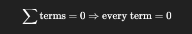
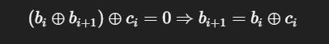

IDEH is a Moroccan CTF competition hosted by INPT. During this event, I solved many challenges while playing solo **lmao**, and it was an amazing experience overall. The competition was intense, fun, and full of learning opportunities. I also had the chance to meet and connect with many great people from the community big thanks to the organizers and especially to the challenge authors
Have fun reading, and see you next year.


---


## 📎 Attachments
[exfil.apk](/attatchement/IDEHv7/exfil.apk)


## IDEH CTF — Exfil (Android Reverse Engineering)

***Category: Mobile / Reverse Engineering***

***Flag format: IDEH{...}***

## 1) Challenge Overview

We are given an Android APK named **exfil.apk**.
The goal is to analyze the application and recover a hidden secret stored inside it.

Initial assumption:
The application hides sensitive data and exposes some functionality through a WebView JavaScript bridge.


### Step 1 — Static analysis

First, decompile the APK.

```bash
jadx exfil.apk -d out
```

This gives us:

```bash
out/
 ├── resources/
 └── sources/
```

Searching for JavaScript bridges:

```bash
grep -R "JavascriptInterface" -n out/sources
```

Output:
```bash
sources/com/cit/ideh/exfil/DocsActivity.java
sources/i1/a.java
```

The interesting class is:
```bash
sources/i1/a.java
```

This file is injected into a WebView as the JavaScript object **IDEH**.

### Step 2 — Inspecting the exposed interface

Opening sources/i1/a.java:

```bash
nano sources/i1/a.java
```

We find:

```java
@JavascriptInterface
public final String readVault() {
    try {
        return a();
    } catch (Exception unused) {
        return "error";
    }
}

```

And the real logic is inside function **a()**.

### Step 3 — Understanding the crypto

The method **a()** does the following:

1. Loads encrypted blob

```java
InputStream is = getResources().openRawResource(R.raw.flag_blob);
```


This corresponds to:

```bash
resources/res/raw/flag_blob
```


2. Splits the blob

```java
nonce = blob[0..11]
ciphertext = blob[12..]
```

So the file is:

```pgsql
[ 12 bytes nonce | encrypted data + GCM tag ]
```

3. Builds AES key from APK signature

```java
Signature sig = packageManager.getPackageInfo(...).signingInfo.getApkContentsSigners()[0];
byte[] digest = SHA256(sig.toByteArray());
SecretKeySpec key = new SecretKeySpec(digest[0:16], "AES");
```

So:

```java
AES key = first 16 bytes of SHA256(apk signing certificate)
```

4. Uses package name as AAD

```java
cipher.updateAAD("com.cit.ideh.exfil".getBytes());
```

So the authenticated data is:

```java
AAD = "com.cit.ideh.exfil"

```

5. Decrypts using AES-GCM

```java
Cipher cipher = Cipher.getInstance("AES/GCM/NoPadding");
cipher.init(DECRYPT, key, new GCMParameterSpec(128, nonce));
plaintext = cipher.doFinal(ciphertext);
```

The output is directly returned as a string.


### Step 4 — Extracting the flag

To decrypt, we need:

| Element        | Source                     |
| -------------- | -------------------------- |
| Encrypted blob | `res/raw/flag_blob`        |
| Nonce          | First 12 bytes             |
| Ciphertext     | Remaining bytes            |
| AES key        | SHA256(signing cert)[0:16] |
| AAD            | `"com.cit.ideh.exfil"`     |


After reproducing this logic and decrypting the blob, we obtain:

**IDEH{m4ster_0f_4ndro1d}**


### IDEH CTF — Frozen Truth 

## 📎 Attachments
[frozen_truth](/attatchement/IDEHv7/frozen_truth)


***Category: Reverse Engineering***

***Format: IDEH{...}***


## 1) Executive Summary

The challenge provides a Linux binary named **frozen_truth** acting as a flag checker.
Initial execution fails due to a GLIBC version mismatch, which strongly suggests that static reverse engineering is required.

By identifying the binary as a PyInstaller-packed Python 3.8 executable, extracting its contents, and reversing the embedded challenge.pyc, we recover a simple Caesar-style decoding routine with a constant shift.

This leads directly to the final flag.


### Step 1 — File Identification

```bash
file frozen_truth
```

Output:
```bash
frozen_truth: ELF 64-bit LSB executable, x86-64, dynamically linked, interpreter /lib64/ld-linux-x86-64.so.2, for GNU/Linux 3.2.0
```

Trying to execute it:

```bash
./frozen_truth
```

Result:

```Makefile
libpython3.8.so.1.0: version `GLIBC_2.38' not found
```

So instead of running it, we move to static analysis.

Running strings reveals:

```bash
PYZ-00.pyz
pyi-runtime-tmpdir
pyiboot01_bootstrap
libpython3.8.so
_MEIPASS
```

This is a classic **PyInstaller executable**.

### Step 2 — Extracting the PyInstaller Archive

We use pyinstxtractor-ng:

```bash
python3 -m pip install --user pyinstxtractor-ng
pyinstxtractor-ng frozen_truth

```
This creates:

```bash
frozen_truth_extracted/

```

Listing files:

```bash
challenge.pyc
PYZ.pyz
PYZ.pyz_extracted/
libpython3.8.so.1.0
...

```

The file of interest is clearly:

```bash
challenge.pyc

```

### Step 3 — Decompiling the Python Bytecode

We use uncompyle6:

```bash
python3 -m pip install --user uncompyle6
uncompyle6 challenge.pyc

```

Recovered Python source (simplified):

```python
SHIFT = 3

encoded_flag = b'...'

def decode(data):
    return bytes([(b - SHIFT) % 256 for b in data])

def main():
    user = input("Enter flag: ").encode()
    if user == decode(encoded_flag):
        print("Correct!")
    else:
        print("Wrong!")

if __name__ == "__main__":
    main()
```

Key observations:

>The flag is not dynamically computed

>It is stored as encoded_flag

>Each byte is decoded with:

```bash
decoded_byte = encoded_byte - 3
```

Simple Caesar shift on raw bytes.

### Step 4 — Recovering the Flag

We dump encoded_flag and decode it:

```python
encoded = b"..."
print(bytes([(b - 3) % 256 for b in encoded]))
```

Output:

**IDEH{compiling_wi7h_pyins7all3r_is_no7_s3cur3}**


### IDEH CTF – Insecured IoT Device 

## 📎 Attachments

[router_dump.bin](/attatchement/IDEHv7/router_dump.bin)

**Category: Forensics**

**Flag format: IDEH{}**

## Executive Summary

In this challenge, we are given a raw binary dump extracted from an insecure IoT device. The goal is to analyze the firmware, extract its filesystem, locate suspicious components, and recover a hidden flag.

By carving the firmware image, mounting the embedded filesystem, and analyzing internal scripts and data files, we discover that the flag is split across several locations and encoded in Base64. After decoding and reassembling these parts, we recover the final flag.

## 1) Provided File

```bash
router_dump.bin
```

This appears to be a full flash dump / firmware image from an IoT router-like device.


### Step 1 – Initial Recon

First, identify the file:

```bash
file router_dump.bin
```

output :

```bash
router_dump.bin: data
```

No clear format, so next step is firmware carving.


### Step 2 – Firmware Analysis with binwalk

We scan the dump to locate embedded filesystems and compressed sections.
```bash
binwalk -e router_dump.bin
```

Result shows something similar to:
```bash
DECIMAL       HEXADECIMAL     DESCRIPTION
------------------------------------------------
65536         0x10000         Squashfs filesystem, little endian

```

Binwalk automatically extracts it into:

```bash
_extracted/
└── squashfs-root/
```

### Step 3 – Exploring the Filesystem

Navigate into the extracted filesystem:

```bash
cd _extracted/squashfs-root
ls
```

Typical embedded Linux layout:

```bash
bin/  etc/  lib/  usr/  var/  sbin/  tmp/
```

This confirms the presence of a full Linux-based IoT firmware.

### Step 4 – Hunting for Interesting Files

We search for scripts, configs, or suspicious data:

```bash
find . -type f | grep -i "telemetry\|state\|device\|flag"
```

Interesting files discovered:

```bash
./etc/device.id
./bin/print
./var/lib/telemetry/state.cache
```

### Step 5 – Static Analysis of Files

1️⃣ /etc/device.id

```bash
cat etc/device.id
```

Output:

```bash
SURFSGtjMDBs
```

Decode:

```bash
echo SURFSGtjMDBs | base64 -d
```

Result:

```bash
IDEH{c00l
```

2️⃣ /bin/print

Checking the file:

```bash
strings bin/print
```

We find an embedded Base64 string:

```bash
X2Yxcm13NHJl
```

Decode:

```bash
echo X2Yxcm13NHJl | base64 -d
```

Result:

```bash
_f1rmw4re
```

3️⃣ /var/lib/telemetry/state.cache


```bash
cat var/lib/telemetry/state.cache
```

Output:

```bash
X2FuNGx5czFzfQ==
```

Decode:

```bash
echo X2FuNGx5czFzfQ== | base64 -d
```

Result:

```bash
_an4lys1s}
```

### Step 6 – Rebuilding the Flag

Collected parts:

```bash
IDEH{c00l
_f1rmw4re
_an4lys1s}
```

Final flag:

**IDEH{c00l_f1rmw4re_an4lys1s}**


### IDEH Rev — “This is the end.”

## 📎 Attachments
[chall](/attatchement/IDEHv7/chall)

***Category: Reverse Engineering***

***Flag format: IDEH{...}***

## 1) Executive Summary

The binary prompts for input, enforces a strict length of 26, then runs a small stack-based virtual machine over a bytecode program stored in .rodata.
The VM computes a sum of 26 byte-sized checks of the form:

```bash

             (bi​⊕bi+1​)⊕ci​​
```

and succeeds only if the sum is 0, which (because the sum can’t overflow 32-bit) forces every term to be 0, giving direct XOR constraints between consecutive characters. Using the known flag prefix IDEH{ resolves the full flag.

## 2) Basic Recon
```bash

file chall
# chall: ELF 64-bit LSB executable, x86-64, statically linked, stripped
```

## 3) Locating main via String Xrefs

The prompt string "oui?" lives in .rodata. We locate it and then find its xref in .text.

Using offsets (from readelf -S):

>.rodata vaddr: 0x47f000

>.rodata file offset: 0x7f000

The prompt is at vaddr 0x47f010, and in the disassembly we find:

```bash
401825: lea rdi, [rip+0x7d7e4]  # 0x47f010 -> "oui?"
401849: call puts
40185d: call fgets
...
401887: cmp rax, 0x1a          # length check == 26
40189c: call 0x401a30          # VM validator(program, size, input)
4018a5: je  success
4018a7: lea rdi, "non..."
4018ae: call puts

```

So the flow is:

>Print prompt "oui?"

>Read input (up to 0x100 bytes)

>Strip newline

>Enforce length == 26

>Run validator sub_401a30(program_ptr, program_len, input)

>If validator returns 0 → success message, else failure

## 4) Understanding the Validator VM (0x401a30)

## 4.1 Bytecode location

The VM is called with:

>rdi = 0x4849a0 (bytecode program)

>esi = 0x1d9 (program size = 473 bytes)

>rdx = input

So the bytecode begins at **.rodata:0x4849a0.**

## 4.2 Instruction set

The VM is a stack machine holding 32-bit integers in a local array.

It dispatches on opcode 0..5 via a jump table. The table resolves to handlers:

| Opcode | Meaning              | Notes                                              |
| -----: | -------------------- | -------------------------------------------------- |
|    `0` | **PUSH_CONST imm32** | 5-byte instruction                                 |
|    `5` | **PUSH_INPUT idx32** | pushes `input[idx]` as integer, 5-byte instruction |
|    `2` | **XOR**              | 1-byte instruction                                 |
|    `1` | **ADD**              | 1-byte instruction                                 |
|    `3` | (unused here) SUB    | present in VM but not used by this program         |
|    `4` | (unused here) MUL    | present in VM but not used by this program         |


Important detail: this VM uses variable-length instructions:

>PUSH_* = 1 opcode byte + 4 imm bytes (total 5)

>arithmetic ops = opcode only (total 1)

## 5) Decompiling the Bytecode Program Logic

When decoding the bytecode, we see:

>**PUSH_INPUT** appears 52 times

>**XOR appears** 52 times

>**ADD appears** 26 times

>**PUSH_CONST** appears 27 times

This strongly suggests 26 independent checks being summed.

Reconstructing the stack expression reveals the VM computes:


and success requires result == 0.

## 5.1 Why this becomes 26 independent constraints

So the sum is at most:

>**26×255=6630**

No 32-bit overflow can occur, so:



Thus for each i:




## 6) Extracted Constants

From the bytecode, the constants are:

```bash
c[0..25] =
[13, 1, 13, 51, 50, 22, 55, 91, 112, 40, 2, 7, 49, 19, 124, 95, 0, 32, 57, 69, 108, 9, 27, 120, 72, 52]
```

So:

>b1 = b0 XOR 13

>b2 = b1 XOR 1

>...

>b25 = b24 XOR 72

and finally the cycle condition matches automatically (b25 XOR b0 == 52)

This means the whole string is determined by b0.

## 7) Recovering the Flag

We know the required format begins with IDEH{, so:

b0 = 'I'

Generate the chain:

```python
b[0] = 'I'
b[i+1] = b[i] ^ c[i]
```

## 8) Solver Script (Extracts from the Binary)

This script:

>extracts the program bytes from .rodata at 0x4849a0

>decodes the VM bytecode (variable-length)

>reconstructs the c[i] constants

>rebuilds the flag using b0='I'

```python
#!/usr/bin/env python3
from pathlib import Path

BIN = "chall"

RO_VA  = 0x47F000
RO_OFF = 0x7F000

PROG_VA   = 0x4849A0
PROG_SIZE = 0x1D9

def va_to_off(va):
    return RO_OFF + (va - RO_VA)

def decode_vm(prog, size):
    pc = 0
    ins = []
    while pc < size:
        op = prog[pc]
        if op in (0, 5):
            imm = int.from_bytes(prog[pc+1:pc+5], "little")
            ins.append((pc, op, imm))
            pc += 5
        else:
            ins.append((pc, op, None))
            pc += 1
    return ins

def main():
    blob = Path(BIN).read_bytes()
    prog = blob[va_to_off(PROG_VA):va_to_off(PROG_VA) + PROG_SIZE + 4]
    ins = decode_vm(prog, PROG_SIZE)

    stack = []
    def push(x): stack.append(x)
    def pop(): return stack.pop()
    def XOR(a, b):
        if a[0] == "const" and b[0] != "const":
            a, b = b, a
        return ("xor", a, b)
    def ADD(a, b):
        ta = a[1] if a[0] == "sum" else [a]
        tb = b[1] if b[0] == "sum" else [b]
        return ("sum", ta + tb)

    for _, op, imm in ins:
        if op == 0:
            push(("const", imm & 0xFFFFFFFF))
        elif op == 5:
            push(("byte", imm))
        elif op == 2:
            b = pop(); a = pop()
            push(XOR(a, b))
        elif op == 1:
            b = pop(); a = pop()
            push(ADD(a, b))

    final = stack[-1][1]
    c = [None] * 26

    for t in final:
        left, right = t[1], t[2]
        ci = right[1] & 0xFF
        a, b = left[1], left[2]
        i, j = a[1], b[1]
        if j == (i + 1) % 26:
            c[i] = ci
        else:
            c[j] = ci

    b = [0] * 26
    b[0] = ord("I")
    for i in range(25):
        b[i+1] = b[i] ^ c[i]

    print("".join(map(chr, b)))

if __name__ == "__main__":
    main()
```

 Final Flag: 
 
 **IDEH{I_h3Ckin_L0ooOv3_VM5}**

 Verify:

```bash
 echo -n "IDEH{I_h3Ckin_L0ooOv3_VM5}" | ./chall
# oui?
# OUIOUIOUIOUIOUIOUIOUIOUIOUIOUIOUIOUIOUIOUIOUIOUIOUIOUI
```


## IDEH  — Deception.exe

**Category:** Malware Analysis / Reverse Engineering / Misc  

**Flag format:** `IDEH{...}`  

**Binary:** `Deception.exe`


## 📎 Attachments

[Deception.exe.zip](/attatchement/IDEHv7/Deception.exe.zip)

---

## 1) Executive Summary

Our SOC team detected a suspicious Windows executable named `Deception.exe`.  
Static analysis revealed that the binary uses process-injection related APIs and contains an embedded encrypted payload.

By reversing the binary, we identified an **RC4 decryption routine** used to decrypt a hidden buffer stored in the `.rdata` section. Re-implementing this routine allowed us to recover the flag.

---

## Step 1 — Initial Triage

Identify the file:

```bash
file Deception.exe


```

Output:

```javascript
PE32+ executable (console) x86-64, for MS Windows
```

Hash for tracking:

```bash
sha256sum Deception.exe
```

```bash
50ecfaaefcd8b5b169123618169d9a0696dcbfa81f7991edb93bbb4128d676f8
```


PE inspection (DIE / PE-Studio / CFF Explorer):

>Architecture: x64

>Compiler: MinGW (GCC)

>19 sections

>Contains `.debug_*` DWARF sections

>Unsigned binary


## Step 2 — Suspicious Indicators

Imports analysis:

```bash
rabin2 -i Deception.exe
```

>`Interesting APIs:`

>`CreateProcessA`

>`ReadProcessMemory`

>`WriteProcessMemory`

>`VirtualProtect`

>`VirtualQuery`

>`NtQueryInformationProcess`

>`ResumeThread`

**Strong indicators of process hollowing / injection malware.**

Strings:
```bash
strings Deception.exe
```

Notable strings:

```perl
C:\Windows\System32\WerFault.exe
-u -p %d -s %d
```

**Masquerading as Windows Error Reporting.**

## Step 3 — Reverse Engineering

Loaded into IDA.

Main findings:

>`main()` calls a function initializing a 256-byte state array.

>Performs byte swaps and modular indexing.

>XORs a buffer with a generated keystream.

This exactly matches the RC4 algorithm (KSA + PRGA).

## Step 4 — Extracting Key and Ciphertext

From `.rdata,` referenced directly by the RC4 function:

```bash
RC4 Key (9 bytes)
23 82 71 87 12 23 12 FF EE
```

Encrypted Buffer (27 bytes)

```bash
13 39 97 51 CA 44 49 D0 4B 89 10 F0 61 8A 27 74
50 F9 B6 52 9C 26 1E B4 E2 29 ED
```

## Step 5 — Decryption Script

```python
def rc4(key, data):
    S = list(range(256))
    j = 0

    # KSA
    for i in range(256):
        j = (j + S[i] + key[i % len(key)]) % 256
        S[i], S[j] = S[j], S[i]

    # PRGA
    i = j = 0
    out = bytearray()
    for b in data:
        i = (i + 1) % 256
        j = (j + S[i]) % 256
        S[i], S[j] = S[j], S[i]
        out.append(b ^ S[(S[i] + S[j]) % 256])

    return bytes(out)


key = bytes.fromhex("23827187122312ffee")
ct  = bytes.fromhex("13399751ca4449d04b8910f0618a277450f9b6529c261eb4e229ed")

print(rc4(key, ct))
```

Output:

```bash
IDEH{D3c3pt10n_h1d35_tru7h}
```

have fun ... always ON TOP?!
